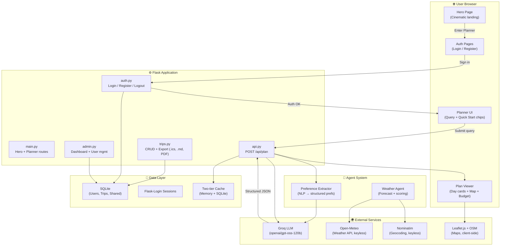
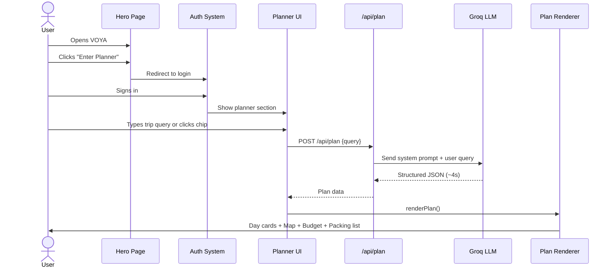

# VOYA Travel Planner — Architecture Diagram

```mermaid
flowchart TD
    subgraph User["🌐 User Browser"]
        A["Hero Page<br/>(Cinematic landing)"]
        B["Auth Pages<br/>(Login / Register)"]
        C["Planner UI<br/>(Query + Quick Start chips)"]
        D["Plan Viewer<br/>(Day cards + Map + Budget)"]
    end

    subgraph Flask["⚙️ Flask Application"]
        R1["main.py<br/>Hero + Planner routes"]
        R2["auth.py<br/>Login / Register / Logout"]
        R3["api.py<br/>POST /api/plan"]
        R4["trips.py<br/>CRUD + Export (.ics, .md, PDF)"]
        R5["admin.py<br/>Dashboard + User mgmt"]
    end

    subgraph Agents["🤖 Agent System"]
        AG1["Preference Extractor<br/>(NLP → structured prefs)"]
        AG2["Weather Agent<br/>(Forecast + scoring)"]
    end

    subgraph External["🌍 External Services"]
        E1["Groq LLM<br/>(openai/gpt-oss-120b)"]
        E2["Open-Meteo<br/>(Weather API, keyless)"]
        E3["Nominatim<br/>(Geocoding, keyless)"]
        E4["Leaflet.js + OSM<br/>(Maps, client-side)"]
    end

    subgraph Data["💾 Data Layer"]
        DB["SQLite<br/>(Users, Trips, Shared)"]
        SESS["Flask-Login Sessions"]
        CACHE["Two-tier Cache<br/>(Memory + SQLite)"]
    end

    A -->|"Enter Planner"| B
    B -->|"Sign in"| R2
    R2 -->|"Auth OK"| C
    C -->|"Submit query"| R3
    R3 --> AG1
    AG1 --> E1
    R3 --> E1
    E1 -->|"Structured JSON"| R3
    R3 --> D
    AG2 --> E2
    AG2 --> E3
    D --> E4
    R4 --> DB
    R2 --> DB
    R5 --> DB
    R3 --> CACHE
```

## Request Flow (Sequence)

```mermaid
sequenceDiagram
    actor User
    participant Hero as Hero Page
    participant Auth as Auth System
    participant Planner as Planner UI
    participant API as /api/plan
    participant Groq as Groq LLM
    participant Render as Plan Renderer

    User->>Hero: Opens VOYA
    User->>Hero: Clicks "Enter Planner"
    Hero->>Auth: Redirect to login
    User->>Auth: Signs in
    Auth->>Planner: Show planner section

    User->>Planner: Types trip query or clicks chip
    Planner->>API: POST /api/plan {query}
    API->>Groq: Send system prompt + user query
    Groq-->>API: Structured JSON (~4s)
    API-->>Planner: Plan data
    Planner->>Render: renderPlan()
    Render->>User: Day cards + Map + Budget + Packing list
```
